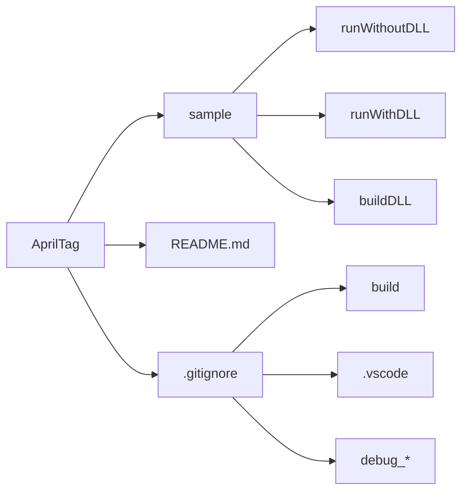
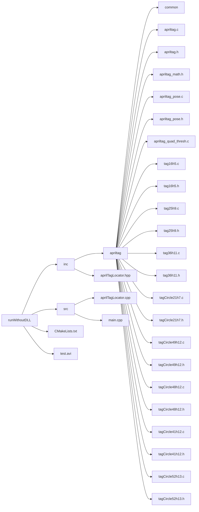
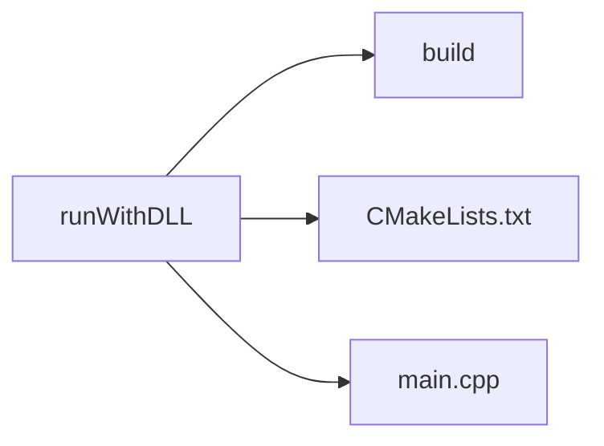
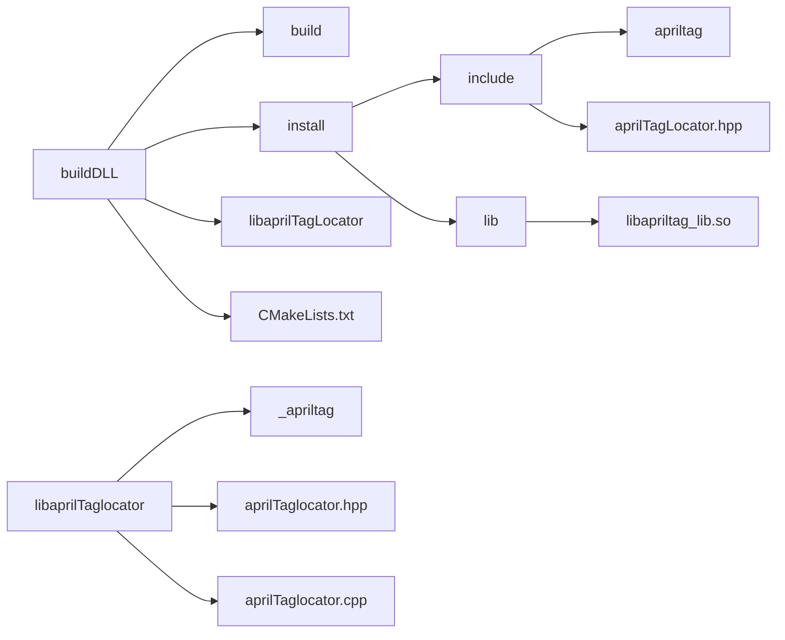
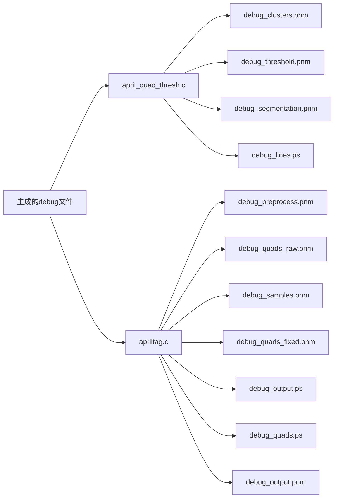

# AprilTagAPI

##  目录 

* [项目介绍](#项目介绍) 

* [使用说明](#使用说明) 

* [获取代码](#获取代码) 

* [文件架构](#文件架构) 

* [使用接口](#使用接口) 

​    * [接口介绍](#接口介绍) 

​    *  [使用样例](#使用样例) 

* [其他](#其他) 

​     * [关于debug_*文件的生成](#关于debug_*文件的生成)

​     * [TODO](#TODO)


## 项目介绍

AprilTag是一个在机器人研究中非常流行的视觉基准库。这个存储库包含了AprilTag的最新版本AprilTag 3，它包括一个更快的(>2x)检测器、改进的小标签检测率、灵活的标签布局和姿态估计。

它能获取标签相对摄像头的6D位姿（标签的x,y,z和yaw,pitch,roll）

为了方便使用，设计者根据apriltag的源代码编写了这个库。

你可以在[这里](https://github.com/AprilRobotics/apriltag-imgs)找到所需标签的图像

本AprilTag库的源代码来源于[apriltag官网](https://april.eecs.umich.edu/software/apriltag.html)

## 使用说明

这个库只能在Linux系统下使用

需要opencv的函数库

## 获取代码

* apriltagAPI**项目主页: <https://github.com/Artinx-Algorithm-Group/AprilTag> **

## 文件架构

（可在Typora中阅读）













## 使用接口

### 接口介绍

#### AprilTagLocator

`AprilTagLocator(tagFamily tag=kTAG36H11);`

* 构造函数，生成识别某种AprilTag的定位器

* Parameters: tagFamily --代表AprilTag的种类

* Returns:  None

#### getAllPos

`vector<AprilTagInfo> getAllPos(const Mat &frame); ` 

* 获取图像信息--Tags的6D位姿

* Parameters:Mat &frame--图像的地址
* Returns: None


#### setCameraParameters

 `   void setCameraParameters(double tagsize, double fx, double fy, double cx, double cy);`

* 设置标定的相机参数
* Parameters: tagsize--代表标识的实际尺寸  

​                                fx，fy，cx，cy--代表相机的四元参数

* Returns: None

* See Also:关于相机的四元参数可见https://docs.opencv.org/4.4.0/d4/d94/tutorial_camera_calibration.html


#### setExtraParameters

`void setExtraParameters(float decimate,float blur,int threads,int debug,int refine_edges);`

* 设置其他参数
* Parameters:

​            decimate--Decimate input image by this factor; 

​            blur--Apply low-pass blur to input; 

​            threads--Use this many CPU threads;

​            debug--Enable debugging output (slow);

​             refine_edges--Spend more time trying to align edges of tags

* Returns:None

### 使用样例

#### 1.不使用动态库

* 设置路径为/sample/runWithoutDLL

* 新建build文件夹

* 标定相机，获取其四元参数

* 打开./src/aprilTagLocator.cpp文件,在setCameraParameters函数中输入标签的大小和四元参数，在initFamily函数中设置所要识别的标签类

* 打开摄像头并运用./inc/aprilTagLocator.hpp文件中的函数识别标签，详见[sample/src/main.cpp](https://github.com/Artinx-Algorithm-Group/AprilTag/blob/master/sample/src/main.cpp)

* 按F5编译，或在build文件夹路径下cmake ..  make

* 效果：有标签时，在图像左上角输出标签的6D位姿。没标签时，左上角显示为检测到标签。

#### 2.使用动态库

* 设置路径为/sample/buildDLL

* 新建build文件夹

* 标定相机，获取其四元参数

* 打开./libaprilTagLocator/aprilTagLocator.cpp文件,在setCameraParameters函数中输入标签的大小和四元参数，在initFamily函数中设置所要识别的标签类

* 在build文件夹路径下 

  ```
  cmake ..
  make
  sudo make install
  ```

  

* 改变路径至/sample/runWithDLL

* 新建build文件夹

* 在build文件夹路径下 

  ```cmake
  cmake ..
  make
  ./OpenCV_template
  ```

  即可执行main.cpp


*注意*：

/sample/buildDLL/CMakelists.txt

```cmake
# 将库apriltag_lib安装到usr/local/lib里
install(TARGETS apriltag_lib LIBRARY DESTINATION lib)
# 将source_directory安装到usr/local/include里
INSTALL(FILES ${PROJECT_SOURCE_DIR}/libaprilTagLocator/aprilTagLocator.hpp
DESTINATION include)
INSTALL(DIRECTORY ${PROJECT_SOURCE_DIR}/libaprilTagLocator/apriltag
DESTINATION include)
```

/sample/runWithDLL/CMakelists.txt

```cmake
target_link_libraries(OpenCV_template /usr/local/lib/libapriltag_lib.so)
```

 如果需要将库apriltag_lib和source_directory安装到不同的路径，需修改以上两个文件。


## 其他

###  [关于debug_* 文件的生成](https://github.com/Artinx-Algorithm-Group/AprilTag/commit/7d8a5295d9ebe4ce6280e66c33680a374a728121) 

将文件中注释的部分取消即可生成debug_* 文件




### TODO

* 做动态库

  


